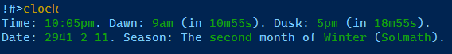
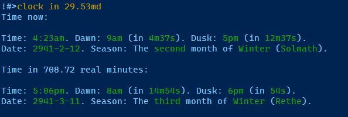
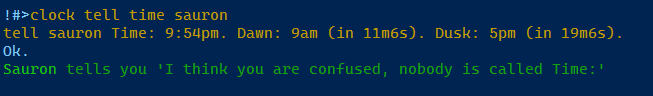

# MUME Clock: Track and display MUME time and date in Mudlet
https://github.com/octavia-mc/mume-clock

This package tracks and displays the MUME time and date along with other information including dawn/dusk (and time until dawn/dusk), month, season, and which month this is of the current season. This information can be automatically displayed at regular intervals: every MUME hour for time and every MUME day for the date.

# Installation

Install via Mudlet console command:
```
lua installPackage "https://github.com/octavia-mc/mume-clock/raw/main/mume-clock.mpackage"
```

Otherwise, download `mume-clock.mpackage` and install the package using Mudlet's package manager.

# Usage

To use this, look at a clock in game and then check the time/date with `clock`, `clock time`, or `clock date`. By default, the time will be displayed every MUME hour and the date will be displayed every MUME day at 12:00 am, which can be useful when looking back in the log.



<!-- 
```
!#>clock
Time: 10:05pm. Dawn: 9am (in 10m55s). Dusk: 5pm (in 18m55s).
Date: 2941-2-11. Season: The second month of Winter (Solmath).
```
 -->

Use `clock in <n>m` and `clock in <n>d` to see what the MUME time and date will be after a number of real minutes or hours, e.g. `clock in 24h`. Use `clock in <n>md` to see what the MUME time and date will be after a number of MUME days, e.g. `clock in 29.53md` (about one synodic moon cycle in MUME):



<!-- 
```
!#>clock in 29.5md
Time now:

Time: 11:33pm. Dawn: 9am (in 9m27s). Dusk: 5pm (in 17m27s).
Date: 2941-2-11. Season: The second month of Winter (Solmath).

Time in 708 real minutes:

Time: 11:33am. Dawn: 8am (in 20m27s). Dusk: 6pm (in 6m27s).
Date: 2941-3-11. Season: The third month of Winter (Rethe).
```
 -->

Use `clock tell [time|date] <player>` to tell another player the time. There are commands for other communication channels as well.



<!--
```
!#>clock tell time sauron
tell sauron Time: 9:54pm. Dawn: 9am (in 11m6s). Dusk: 5pm (in 19m6s).
Ok.
Sauron tells you 'I think you are confused, nobody is called Time:'
```
 -->

# Commands

```
- clock help : Show all commands and options.
- clock : Check the time and date.
- clock (time|date) : Check time or date (and season).
- clock in <n>m : Show what the MUME time will be after <n> real minutes. Accepts decimal values.
- clock in <n>h : Show what the MUME time will be after <n> real hours. Accepts decimal values.
- clock in <n>md : Show what the MUME time will be after <n> MUME days. Accepts decimal values.
- clock say (time|date) : Say the time or date.
- clock narrate (time|date) : Narrate the time or date.
- clock tell (time|date) <player> : Tell the time or date to another player.
- clock toggle compact : Toggle compact display of the time (less spacing).
- clock toggle automatic time : Toggle whether to display the time every MUME hour (1 minute).
- clock toggle automatic date : Toggle whether to display the date every MUME day (24 minutes).
- clock set highlight : Set the highlight color for data. Use "grey" for no highlight.
- clock show colours : Display a list of colours for use with the highlight option.
```

# Changelog

- 2025-3-30
  - Added `clock in <n>md` to show what the MUME time will after <n> in-game days, e.g. `clock in 29.5md`
  - Added `clock in <n>m` and `clock in <n>h` to show what the MUME time will be in real minutes or hours, e.g. `clock in 2h`
  - Renamed commands to all start with `clock` and `clock` without arguments now shows the time and date
- 2025-2-14
  - Added `clock toggle compact` to change whether spacing is used when displaying time
  - Changed the color of the time display to match MUME's styling of inline numbers
  - Fixed being unable to match Nínui and Nórui to their month number
  - Fixed dusk times being shown with `am` instead of `pm`
  - Fixed failure to initialize due to changes to the formatting of MUME's `time` command (`Year` became `year`)
  - Fixed the time and date displays using grey instead of the client's foreground color
  - Other minor adjustments
- 2015-2-12
  - Added aliases to say date, narrate date, and tell date to another player
- 2015-2-10
  - Automatic loading/saving of clock data. May you never have to look at another clock again!
- 2015-2-7
  - Improved the way options are set
- 2014-2-3
  - Initial release
